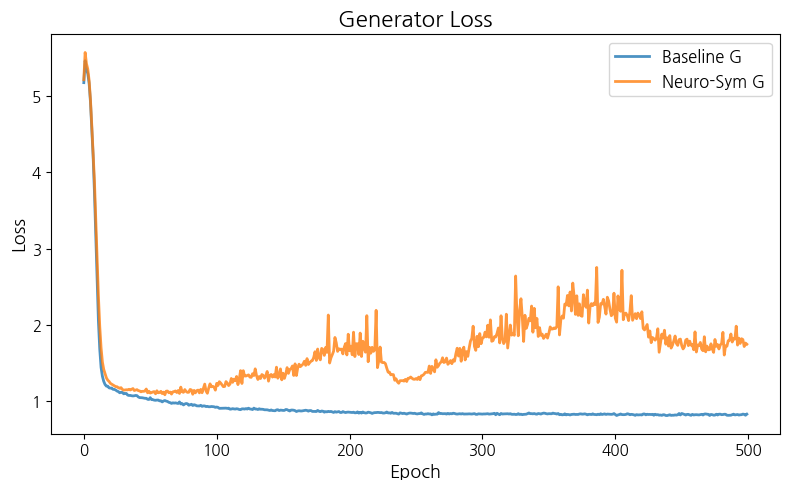
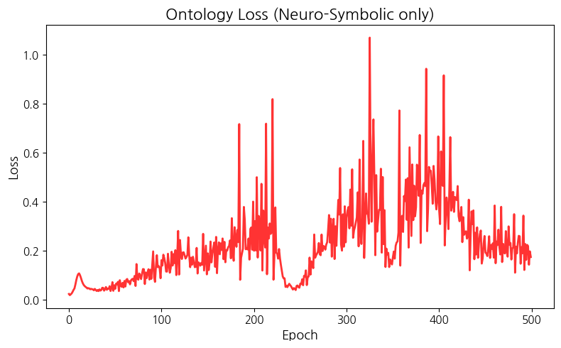
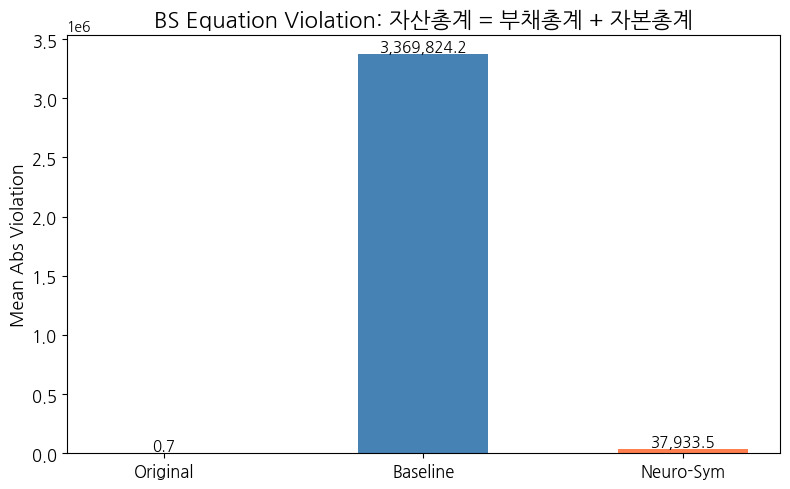
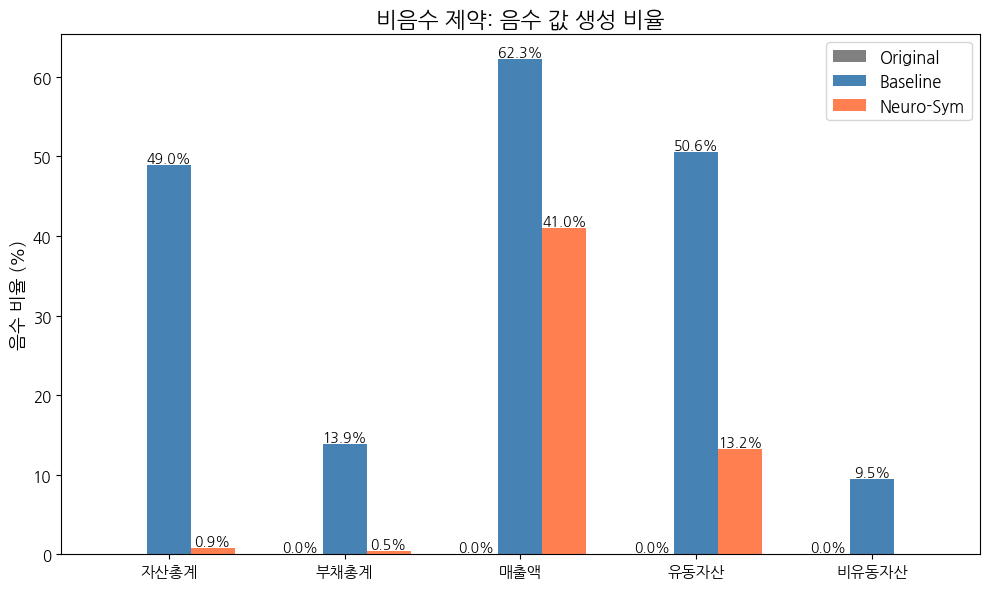
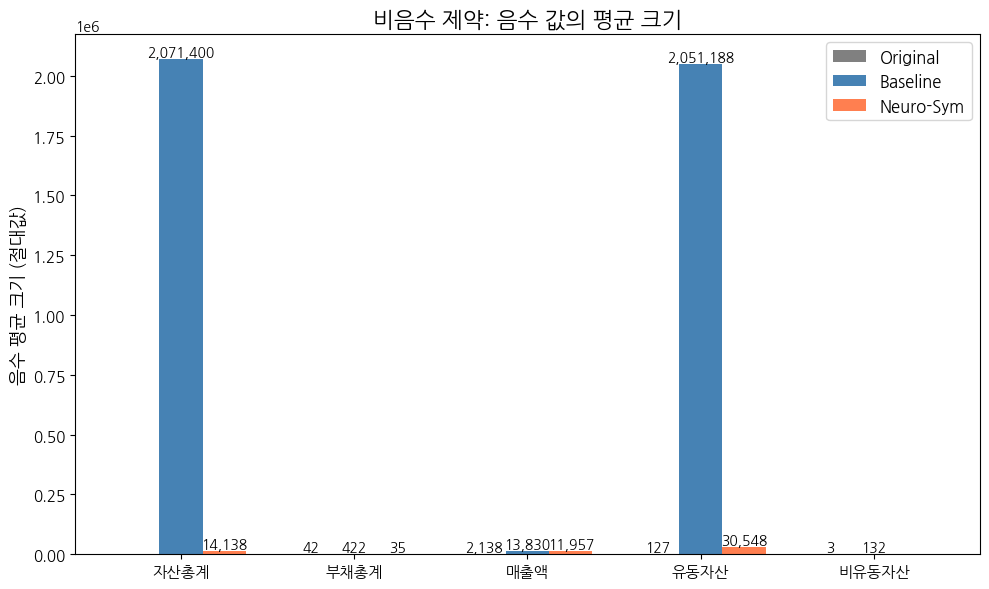

# Neuro-Symbolic CT-GAN 기반 재무 합성데이터 생성

## 1. 목적

신용보증기금에서 제공한 재무제표 데이터 샘플에 대하여 Baseline CT-GAN과 Neuro-Symbolic CT-GAN을 비교하여 ontology loss의 효과를 검증한다.

## 2. 데이터

53,213개 기업 재무제표(93컬럼: 범주형 3, 수치형 90)를 사용한다.

## 3. 전처리: 독립/종속 변수 분리

90개 수치형 변수 중 10개는 다른 변수의 선형 결합으로 정의되는 종속 변수이다. GAN은 독립 변수 80개만 생성하고, 종속 변수 10개는 수식으로 복원한다.

```
  90개 수치형 변수
  +--------------------------------------------+
  |  독립 변수 (80개)        종속 변수 (10개)    |
  |  +-----------------+   +----------------+  |
  |  | 당좌자산         |   | 유동자산        |  |
  |  | 재고자산         |   | 자산총계        |  |
  |  | 유동부채         |   | 부채총계        |  |
  |  | 자본금 ...       |   | 영업이익 ...    |  |
  |  +-----------------+   +----------------+  |
  |    GAN이 생성            수식으로 복원       |
  +--------------------------------------------+
```

종속 변수 간 의존관계를 고려하여 복원 순서를 결정한다.

```
  독립 변수 (GAN 생성)
       |
       v
  유동자산 = 당좌자산 + 재고자산
  비유동자산 = 투자자산 + 유형자산 + 무형자산 + 기타비유동자산
       |
       v
  자산총계 = 유동자산 + 비유동자산
  부채총계 = 유동부채 + 비유동부채
  자본총계 = 자본금 + 자본잉여금 + ...
       |
       v
  매출총이익 → 영업이익 → 법인세차감전이익 → 계속사업이익 → 당기순이익
```

## 4. 모델 구조

```
  +------------------+     가짜 데이터      +------------------+
  |    Generator     | ----------------->  | Discriminator    |
  |  노이즈(128)     |     진짜 데이터      |  진위 판별        |
  |  + 조건(32)      |       +-----------> |                  |
  |  = 160차원 입력   |       |            |  80 + 24 + 32    |
  |  출력: 80+3      |  원본 데이터         |  = 136차원 입력   |
  +------------------+                     +------------------+
```

조건벡터는 3개 범주형 변수의 원-핫 인코딩(32차원)이다.

## 5. 온톨로지 Loss

- 구성한 온톨로지 규칙
    : **자산총계 = 부채총계 + 자본총계** (BS 항등식)

- 이유
    : 수식 복원으로 `자산총계 = 유동자산 + 비유동자산`은 이미 보장된다. 그러나 회계학에서 동일한 자산총계는 **다른 경로**로도 성립해야 한다:
    - **경로 1 (수식 복원)**: 자산총계 = 유동자산 + 비유동자산 → 이 값으로 실제 복원됨
    - **경로 2 (BS 항등식)**: 자산총계 = 부채총계 + 자본총계 → 이 관계도 성립해야 함

    경로 1로 결정된 자산총계와, 별도 그룹에서 복원된 (부채총계 + 자본총계)는 서로 다른 독립 변수로부터 산출되므로 일치가 보장되지 않는다. 따라서 Generator가 이 관계를 위반할 때마다 손실(페널티)을 부과하여, 두 경로의 결과가 최대한 일치하도록 유도하는 것이 ontology loss의 역할이다.

GAN이 생성하는 80개 독립 변수 중, 자산총계·부채총계·자본총계에 관여하는 변수는 아래 3개 그룹으로 나뉜다.
각 그룹은 서로 겹치는 변수가 하나도 없다:

```
  ┌─ 그룹 A: 자산총계를 구성하는 독립 변수 (6개) ─────────────────────┐
  │                                                                  │
  │  당좌자산금액 ─┐                                                  │
  │  재고자산금액 ─┼─→ 유동자산 ──────┐                                │
  │               │                  │                               │
  │  투자자산금액 ─┐                  ├─→ 자산총계 (= 유동 + 비유동)    │
  │  유형자산금액 ─┤                  │                               │
  │  무형자산     ─┼─→ 비유동자산 ────┘                                │
  │  기타비유동    │                                                   │
  │  자산금액    ──┘                                                   │
  └───────────────────────────────────────────────────────────────────┘

  ┌─ 그룹 B: 부채총계를 구성하는 독립 변수 (2개) ─────────────────────┐
  │                                                                  │
  │  유동부채   ──┬─→ 부채총계 (= 유동부채 + 비유동부채)               │
  │  비유동부채 ──┘                                                   │
  └───────────────────────────────────────────────────────────────────┘

  ┌─ 그룹 C: 자본총계를 구성하는 독립 변수 (5개) ─────────────────────┐
  │                                                                  │
  │  자본금           ──┐                                             │
  │  자본잉여금금액    ──┤                                             │
  │  자본조정금액      ──┼─→ 자본총계 (= 자본금 + 자본잉여금 + ...)    │
  │  기타포괄손익누계금액┤                                             │
  │  이익잉여금액      ──┘                                             │
  └───────────────────────────────────────────────────────────────────┘
```

GAN은 위 13개 독립 변수를 각각 자유롭게 생성한다.
그룹 A·B·C 사이에는 공유하는 변수가 없으므로, 복원된 세 총계 값 사이에
`자산총계 = 부채총계 + 자본총계`가 성립할 구조적 근거가 없다:

```
  그룹 A의 독립 변수 6개        그룹 B의 독립 변수 2개    그룹 C의 독립 변수 5개
        │ (수식 복원)                │ (수식 복원)              │ (수식 복원)
        v                           v                         v
    자산총계                     부채총계                  자본총계
        │                           │                         │
        │                           └────────┬────────────────┘
        │                                    │
        v                                    v
    자산총계        =?=          부채총계 + 자본총계
        │                                    │
        └──── 서로 다른 독립 변수에서 ─────────┘
              각각 산출되어 일치 보장 불가
                         │
                         v
                   ❌ 불일치 발생!

  → ontology loss로 이 불일치에 페널티를 부과하여
    GAN이 세 그룹의 균형을 학습하도록 유도함
```

이를 해결하기 위해 Generator loss에 ontology loss를 추가하여, BS 항등식 위반을 페널티로 부과함.

또한 자산총계, 부채총계, 매출액, 유동자산, 비유동자산 등 현실에서 음수가 될 수 없는 총계 항목에 대해 비음수 제약도 함께 부과함. GAN은 학습 초기에 비현실적인 음수 값을 생성할 수 있으므로, 음수 생성 시 페널티를 주어 현실적인 범위를 유도함:

```
  Generator 학습 시 Loss 구성:

  ┌─────────────────────────────────────────────────────────┐
  │                                                         │
  │  G Loss = Adversarial     ... Discriminator를 속이는 손실 │
  │         + Conditional     ... 조건 범주 일치 손실         │
  │         + λ × Ontology    ... 회계 규칙 위반 페널티 (추가) │
  │                                                         │
  └─────────────────────────────────────────────────────────┘

  Ontology Loss 상세:

  ┌─────────────────────────────────────────────────────────┐
  │                                                         │
  │  등식 제약 (BS 항등식):                                   │
  │    (자산총계 − 부채총계 − 자본총계)²                       │
  │    ─────────────────────────────── → 위반 클수록 손실 증가 │
  │              scale                                      │
  │                                                         │
  │  비음수 제약 (총계 항목 5개):                               │
  │    Σ  relu(−총계항목)²                                    │
  │       ───────────────── → 음수 생성 시 손실 증가           │
  │          scale                                          │
  │                                                         │
  │  scale = 각 항의 평균 절대값 (|mean|)                      │
  │  → 재무 데이터는 수억 단위이므로 제곱 오차가 10¹²까지       │
  │    폭주할 수 있다. scale로 나누어 상대적 오차로 정규화한다.  │
  │                                                         │
  └─────────────────────────────────────────────────────────┘
```

## 6. 학습 결과
- Config
    - 500 epoch
    - batch 2048
    - lr=2e-4
    - λ=1.0

- **Baseline**: G Loss 1.02→0.83 안정 수렴, D Loss ~0.70 유지.
- **Neuro-Sym**: G Loss ~1.75 (규칙 준수와 적대적 학습의 동시 수행으로 상승). Onto Loss 0.05~0.67 범위 진동.


```
==================================================
Training: Baseline CTGAN
==================================================
[50/500] D:0.7305  G:1.0246
[100/500] D:0.7140  G:0.9214
[150/500] D:0.7111  G:0.8839
[200/500] D:0.7125  G:0.8595
[250/500] D:0.7059  G:0.8442
[300/500] D:0.7093  G:0.8341
[350/500] D:0.7079  G:0.8355
[400/500] D:0.7137  G:0.8400
[450/500] D:0.7082  G:0.8223
[500/500] D:0.7052  G:0.8324
```



```
==================================================
Training: Neuro-Symbolic CTGAN
==================================================
[50/500] D:0.7130  G:1.1328  Onto:0.0591
[100/500] D:0.6940  G:1.1468  Onto:0.0877
[150/500] D:0.7004  G:1.2816  Onto:0.1034
[200/500] D:0.6365  G:1.8792  Onto:0.4000
[250/500] D:0.6887  G:1.2886  Onto:0.0490
[300/500] D:0.6533  G:1.7547  Onto:0.2339
[350/500] D:0.6912  G:1.8285  Onto:0.1438
[400/500] D:0.6607  G:2.4163  Onto:0.6660
[450/500] D:0.6947  G:1.8153  Onto:0.2598
[500/500] D:0.7223  G:1.7479  Onto:0.1741
```

## 7. 평가

10,000개 합성 샘플을 생성하여 평가함.

### 7.1 회계 규칙 위반

수식 기반 규칙 10개 (Mean Abs Error):

| 규칙 | Original | Baseline | Neuro-Sym |
|---|---:|---:|---:|
| 매출총이익 = 매출액 − 매출원가 | 265.45 | 0.00 | 0.00 |
| 영업이익 = 매출총이익 − 판매관리비 | 433.65 | 0.00 | 0.00 |
| 법인세차감전이익 | 0.18 | 0.00 | 0.00 |
| 계속사업이익 | 3.95 | 0.00 | 0.00 |
| 당기순이익금액 | 3.89 | 0.00 | 0.00 |
| 부채총계 = 유동부채 + 비유동부채 | 25,054.68 | 0.00 | 0.00 |
| 자본총계 = 자본금 + 자본잉여금 + ... | 1.98 | 0.00 | 0.00 |
| 유동자산 = 당좌자산 + 재고자산 | 1,382.14 | 0.00 | 0.00 |
| 비유동자산 = 투자자산 + 유형자산 + ... | 294.98 | 0.00 | 0.00 |
| 자산총계 = 유동자산 + 비유동자산 | 25,562.42 | 0.00 | 0.00 |

종속 변수를 수식으로 복원했으므로 두 모델 모두 **위반 0.0**임. 원본 데이터는 누락 계정·반올림 등으로 비영(non-zero) 오차가 존재함.

### 7.2 BS 항등식 위반

| 모델 | MAE |
|---|---:|
| Original | 0.73 |
| Baseline | 3,369,824 |
| **Neuro-Sym** | **37,934** |

Neuro-Sym이 Baseline 대비 약 **89배 개선**됨.



### 7.3 비음수 제약 위반

자산총계, 부채총계, 매출액, 유동자산, 비유동자산 5개 항목에 대해 음수 값 생성 여부를 평가함.
각 항목별로 (1) 음수 비율(%)과 (2) 음수 평균 크기(절대값)를 측정함.





- Original 데이터에서는 해당 항목에 음수가 거의 존재하지 않음
- Baseline은 ontology 제약 없이 학습하므로 음수 값을 자유롭게 생성할 수 있음
- Neuro-Sym은 비음수 페널티를 통해 음수 생성 비율과 크기가 감소하도록 유도됨

### 7.4 통계적 유사성

| 지표 | Baseline | Neuro-Sym |
|---|---:|---:|
| Mean KS statistic | **0.6158** | 0.6452 |
| 상관행렬 Frobenius dist. | **41.47** | 51.11 |

- **KS statistic**: 원본과 합성 데이터의 컬럼별 분포 차이. 0이면 완벽히 동일, 1이면 완전히 상이. **낮을수록 우수**.
- **Frobenius distance**: 원본과 합성 데이터의 90×90 상관행렬 차이. 0이면 상관 구조 완벽 일치. **낮을수록 우수**. 본 실험에서 41.47~51.11은 원소당 평균 약 0.46~0.57의 상관계수 차이에 해당하며, 상관계수 범위[-1, 1] 대비 상당한 차이임. 두 모델 공통적으로 상관 구조 재현이 부족하며, CT-GAN의 구조적 한계(소규모 네트워크, 제한된 학습)에 기인함.

두 지표 모두 Baseline이 소폭 우수함. Neuro-Sym은 ontology loss가 Generator에 추가 제약을 부과하므로 분포 재현에서 소폭 저하가 발생함.

## 8. 결론

```
  +--------------------+------------------+------------------+
  |        측면        |    Baseline      |   Neuro-Sym      |
  +--------------------+------------------+------------------+
  |  수식 규칙(10개)   |   완벽 충족       |   완벽 충족       |
  |  BS 항등식 위반     |   3,369,824      |   37,934 (89배↓) |
  |  비음수 제약       |   제약 없음       |   페널티 적용     |
  |  분포 유사성(KS)   |   0.6158 (우수)   |   0.6452         |
  |  상관 보존(Frob)   |   41.47 (우수)    |   51.11          |
  +--------------------+------------------+------------------+
```

Neuro-Symbolic 모델은 BS 항등식 위반을 89배 감소시키고, 비음수 제약을 통해 비현실적 음수 생성을 억제함. 대신 통계적 유사성에서 소폭 저하가 발생함. λ 조정이나 학습 스케줄링을 통해 이 trade-off를 추가 최적화할 수 있음.
